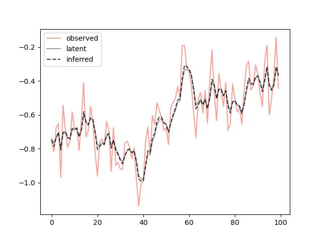

# About the project
jaxman is yet another library that implements the [Kalman filter](https://en.wikipedia.org/wiki/Kalman_filter). This library is mainly intended as a self-study project in which to learn to [JAX](https://github.com/google/jax). The implementation is inspired by both [pykalman](https://pykalman.github.io/) and [simdkalman](https://github.com/oseiskar/simdkalman), and like simdkalman implements support for vectorized inference across multiple timeseries. As it's implemented in JAX and utilizes its JIT capabilities, we achieve blazing fast inference for 1,000s (sometimes even 100,000s) of parallel timeseries.

# Getting started
Follow the below instructions in order to get started with jaxman.

## Prerequisites
Start by [installing jax](https://jax.readthedocs.io/en/latest/installation.html).

## Installation
The library is currently not available on pypi, and there are currently no plans on releasing it there, so install it via
```
https://github.com/tingiskhan/jaxman
```

# Usage
The API is inspired by pykalman's. A trivial random walk example follows below, in which we simulate 100,000 independent series of length 100, and then filter the observations
```python
from jaxman import KalmanFilter
import jax.random as jaxrnd
from timeit import timeit
import matplotlib.pyplot as plt

trans_mat = 1.0
trans_cov = 0.05 ** 2

obs_mat = 1.0
obs_cov = 0.1 ** 2

kf = KalmanFilter(trans_mat, trans_cov, obs_mat, obs_cov)

x, y = kf.sample(100, jaxrnd.PRNGKey(123), (100_000,))
result = kf.filter(y)

# And do a quick timing
print(timeit(lambda: kf.filter(y), number=100))

fig, ax = plt.subplots()

ax.plot(y[:, 0], color="salmon", label="observed", alpha=0.75)
ax.plot(x[:, 0], color="gray", label="latent", alpha=0.75)

ax.plot(result.filtered_means()[:, 0], color="black", linestyle="--", label="inferred", alpha=0.75)
ax.legend()

plt.show()
```
Resulting in the following pretty picture

<div align="center"> 
    
</div>

# Disclaimers
Note that this project is not endorsed, affiliated or supported by Google/JAX, the name is just a mash-up of Kalman and JAX.